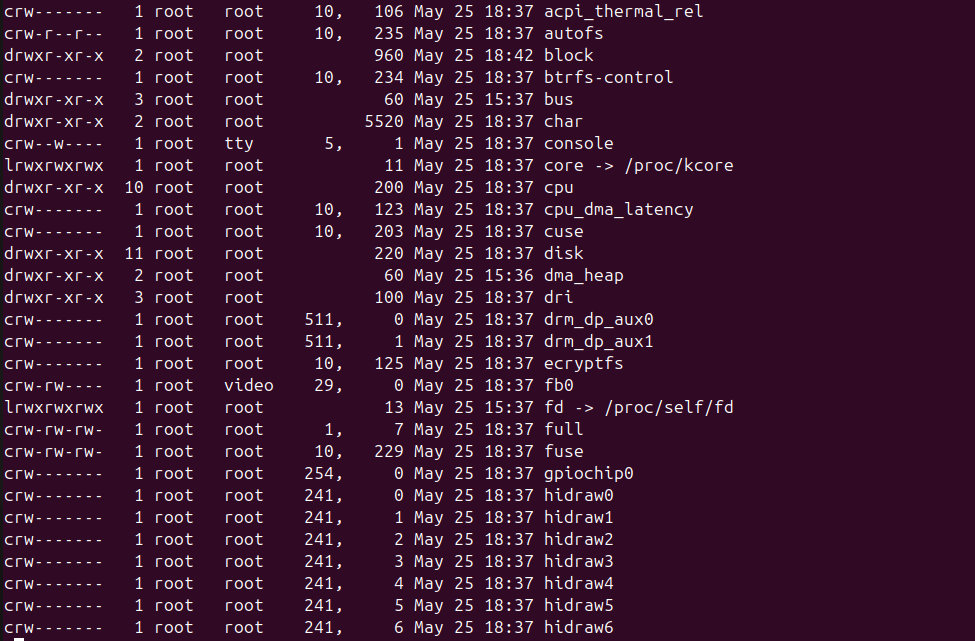
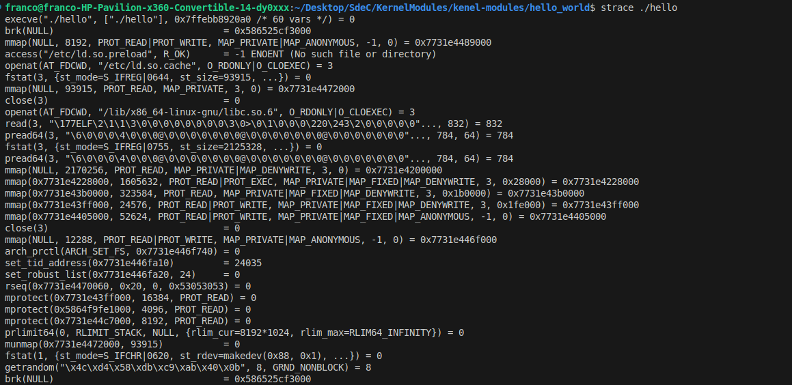

# TP 4 - Módulos del Kernel en Linux

## Grupo Foobar

- Juan Pablo Sanchez Busso
- Leonardo Ariel Sánchez
- Godoy Emiliano
- Cirrincione, Franco

## Introducción

En este trabajo práctico comenzamos a interactuar directamente con el espacio del kernel en Linux, utilizando módulos que extienden la funcionalidad del sistema operativo sin necesidad de recompilarlo. Esta práctica está basada en el repositorio de la cátedra y tiene como objetivo introducirnos al desarrollo de módulos del kernel y conceptos clave como el espacio de usuario, seguridad del kernel, firma de módulos y diferencias con programas tradicionales.

## Preparación del entorno

### Requisitos previos

- Linux (se recomienda Ubuntu)
- Paquetes necesarios:

```bash
sudo apt-get update
sudo apt-get install build-essential checkinstall kernel-package linux-source
```
### Compilación y carga del módulo

```bash
make
sudo insmod mimodulo.ko
dmesg | tail
lsmod | grep mimodulo
```

<p align="center">
    
</p>

*Figura 1: Captura de pantalla mostrando la carga del módulo.*

```bash
sudo rmmod mimodulo
dmesg | tail
```

<p align="center">
    
</p>

*Figura 2: Captura de pantalla mostrando la descarga del módulo.*

---

### Desafío #1
- ¿Qué es checkinstall y para qué sirve?

Checkinstall es una herramienta que permite generar paquetes `.deb`, `.rpm` o `.tgz` a partir de una instalación desde código fuente. Esto facilita la instalación y desinstalación futura mediante el gestor de paquetes del sistema.

- Empaquetado del módulo hello world

```bash
sudo checkinstall make install
```


<p align="center">
    
</p>

*Figura 3: Captura de pantalla el empaquetado del módulo.*


- Seguridad del kernel y firma de módulos
   - Para evitar la carga de módulos sin firmar, se puede configurar Secure Boot y exigir firmas digitales.
   - **Rootkits**: son herramientas que operan en espacio del kernel ocultando procesos, archivos, o incluso el propio rootkit. Por eso, es importante restringir la carga de módulos no firmados.

### Desafío #2
- Diferencias entre programa y módulo

| Concepto  | Programa             | Módulo del kernel           |
| --------- | -------------------- | --------------------------- |
| Espacio   | Usuario              | Kernel                      |
| Funciones | Bibliotecas estándar | Funciones del kernel        |
| Seguridad | Aislado del sistema  | Riesgo alto, acceso directo |
| Funciones disponibles | printf, malloc, fopen, etc  | printk, kmalloc, copy_to_user, etc |

- Espacio de usuario vs kernel
    - El espacio de usuario está separado del kernel por razones de seguridad y estabilidad.
    - Los programas no pueden acceder directamente a memoria del kernel.

- Drivers y `/dev`


```bash
ls -l /dev | less
```

<p align="center">
    
</p>

*Figura 4: Captura de una de las paginas del contenido de drivers (292 entradas).*


- Análisis con `modinfo`

```bash
modinfo mimodulo.ko
modinfo /lib/modules/$(uname -r)/kernel/crypto/des_generic.ko
```


<p align="center">
    
</p>

*Figura 5: Captura de pantalla de la salida de modinfo con el modulo sin firmar.*

<p align="center">
    
</p>

*Figura 6: Captura de pantalla de la salida de modinfo con el modulo con firma.*


- Módulos cargados vs disponibles

```bash
lsmod
cat /proc/modules
find /lib/modules/$(uname -r) -type f -name "*.ko"
```

- Dispositivo sin driver
Si no hay módulo disponible para cierto hardware, el sistema no podrá comunicarse correctamente con el dispositivo.

### Segmentación y trazas

- **¿Qué es un segmentation fault?**  
Un segmentation fault ocurre cuando un programa intenta acceder a una región de memoria que no tiene permiso para usar. Esto puede suceder, por ejemplo, al intentar leer o escribir en una dirección de memoria inválida o protegida.

- **¿Cómo lo maneja el kernel?**  
El kernel detecta esta violación de acceso a memoria mediante el mecanismo de protección de memoria del hardware. Cuando ocurre un segmentation fault, el kernel genera una señal `SIGSEGV` y la envía al proceso que causó la violación. Si el proceso no maneja esta señal, el kernel termina el proceso y registra el evento en los logs del sistema.

- **¿Cómo lo maneja un programa?**  
Un programa puede manejar un segmentation fault implementando un manejador para la señal `SIGSEGV` utilizando funciones como `signal` o `sigaction`. Esto permite al programa realizar acciones específicas, como liberar recursos o registrar información de depuración, antes de finalizar. Sin embargo, en la mayoría de los casos, un segmentation fault indica un error grave en el programa que debe corregirse.


- ¿Cómo ver las llamadas al sistema?
Se utilizó `strace` para interceptar las llamadas al sistema realizadas por un programa simple como hello_world. Esto permite observar funciones como `write`, `open`, `read`, etc.
```bash
strace ./hello
```

<p align="center">
    
</p>

*Figura 8: Captura de pantalla del strace de hello.*

- Firma de módulo
Se documentó el intento de firma del módulo personalizado utilizando `sign-file`. Se generó un par de claves RSA y se firmó el archivo `.ko` (Figura 6)

```bash
openssl req -new -x509 -newkey rsa:2048 -keyout MOK.priv -outform DER -out MOK.der -nodes -days 36500 -subj "/CN=MiFirmaModulo/"
sudo mokutil --import MOK.der
sudo /usr/src/linux-headers-$(uname -r)/scripts/sign-file sha256 MOK.priv MOK.der mimodulo.ko
modinfo mimodulo.ko | grep signer
```
```markdown
filename:       /home/franco/Desktop/SdeC/KernelModules/kenel-modules/hello_world/mimodulo.ko
author:         Grupo Foobar sdc
description:    Modulo Hello World
license:        GPL
srcversion:     D0DC50749C59EF3598145A1
depends:        
retpoline:      Y
name:           mimodulo
vermagic:       6.11.0-24-generic SMP preempt mod_unload modversions 
sig_id:         PKCS#7
signer:         MiFirmaModulo
sig_key:        60:07:F3:F6:88:CC:80:44:F2:36:BD:21:E9:A5:02:41:50:B2:9C:6A
sig_hashalgo:   sha256
signature:      9A:80:F0:1C:2A:B5:70:40:1D:7D:6E:8B:B6:10:90:10:F2:8C:C8:ED:
                A5:9D:0E:56:E0:2E:A3:3D:5F:0D:A3:A8:F9:06:C2:6A:EB:DE:90:40:
                F4:B7:6E:CB:13:FD:98:F8:6E:D3:4F:49:7D:01:B9:69:DD:C1:7D:F0:
                2B:7B:AB:CD:8E:B1:5A:AD:34:5D:05:DA:D1:1B:36:95:7C:20:90:E3:
                21:AC:F1:D3:72:D2:0A:90:67:DF:71:80:00:E8:21:D0:49:24:76:97:
                30:77:04:6A:F3:25:4F:61:88:F3:4D:21:1D:1B:F1:B3:1C:54:3C:62:
                4A:74:67:DA:5A:3F:C7:04:84:3F:EC:EC:F4:7D:D1:CF:0E:2C:EF:77:
                E7:10:C1:C2:1E:56:92:53:1D:B1:AC:EE:AB:AB:73:C7:2F:0D:50:35:
                04:43:71:3A:B2:52:BC:0E:E2:9A:21:D2:E1:5B:4E:94:39:38:25:66:
                29:69:69:B1:96:39:5A:86:5B:EA:1C:DD:F6:7F:43:51:74:F8:68:F9:
                B4:3B:5D:9B:40:57:62:CB:27:1D:0D:A2:0F:1F:F2:DB:1D:A0:A1:9F:
                E8:C5:E3:5C:4D:CE:04:D9:0A:67:97:F3:11:24:8D:06:C9:81:7C:D5:
                B6:FA:F0:4E:04:E7:18:B3:02:8F:48:C0:1A:9B:43:F2
```

- Pregunta: ¿Qué pasa si mi compañero con Secure Boot habilitado intenta cargar mi módulo?
Secure Boot bloquea módulos que no estén firmados con una clave reconocida por el firmware. Si no tiene cargada la clave publica en su sistema, no podra cargar el módulo

- Evidencia de la compilación, carga y descarga de su propio módulo imprimiendo el nombre del equipo en los registros del kernel

<p align="center">
    
</p>

*Figura 9: Captura de pantalla del make del modulo.*


<p align="center">
    
</p>

*Figura 10: Captura de pantalla de la carga del modulo.*


<p align="center">
    
</p>

*Figura 11: Captura de pantalla de la descarga del modulo.*


- Caso GRUB y Secure Boot

    - ¿Consecuencia principal?
    La imposibilidad de iniciar Linux en arranques duales debido a problemas de verificación de firma tras el parche.

    - ¿Qué implica desactivar Secure Boot?
    Se pierde la protección contra bootkits o carga de código no firmado en etapas tempranas del arranque.

    - ¿Propósito principal de Secure Boot?
    Garantizar que solo software verificado se ejecute durante el arranque del sistema, previniendo malware a nivel de firmware.

## Conclusión
Este trabajo permitió la introducción práctica a la programación de módulos del kernel en Linux, contrastando el entorno del usuario con el del kernel, y abordando aspectos importantes como seguridad, drivers y manejo de errores. Además, se incluyeron prácticas reales como la firma de módulos y análisis con herramientas como `modinfo` y `strace`
